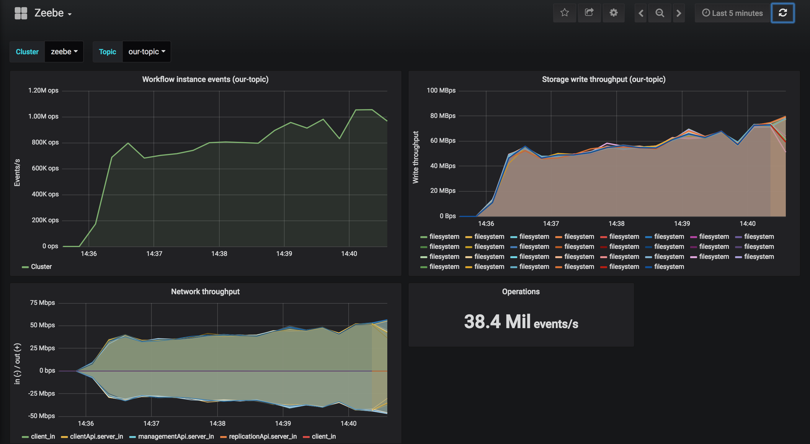

# Zeebe AWS Performance Tests

## Why and What is this about?
This repo shows you how to setup a simple performance testing environment for Zeebe in the cloud on AWS. This repo is **not** supposed to show you a recommended production configuration, but rather to showcase how one could test performance regarding scaling and fault tolerance in a realistic environment.

Running these tests might help you:
1. understand underlying concepts of Zeebe regarding clustering
1. determine the right number of partitions for your use case
1. provide a rough idea how many AWS instances and which type you'll need for your workflow application

## How to run this?

In order to run this repo you will need:
  1. Access to AWS
  1. Terraform installed on your machine
  1. Ansible installed on your machine
  1. (Optional for Monitoring): Docker & Docker-Compose installed on your machine

### Terraform
In this example, we use Terraform to spawn the AWS infrastructure.

If you never worked with Terraform, just install it locally and look into the `terraform/main.tf` file.

After setting up terraform, you can run it using

`terraform apply`

and

`terraform destroy`

### Ansible
In this example, we use ansible scripts to install all necessary tools / software for our Zeebe cluster and our Zeebe clients on AWS. All playbooks use a Dynamic Inventory so that you don't have to specify the AWS hosts manually, but rather it will pick up the hosts from your AWS account.

We have two folders:
#### a) Broker:
Here, you'll find Ansible scripts to set up your Zeebe Cluster in a repeatable manner.
You should run the scripts as follows:

```sh
ansible-playbook setup.yml
ansible-playbook zeebe.yml
ansible-playbook restart-zeebe.yml
```

Note that the playbook 'restart-zeebe' removes the data directory and basically gives you a fresh Zeebe cluster with correct configuration.

#### b) Client:
Here, you'll find Ansible scripts to set up your Zeebe Client, which is responsible for starting instances.
You should run the scripts as follows:
```sh
ansible-playbook setup-nonblocking-start.yml
```

Once your Zeebe cluster is running (you've successfully executed ansible-playbook restart-zeebe.yml), you will need to create a new topic and deploy your workflow.
You can do so using either [zbctl](https://github.com/zeebe-io/zbctl) or using the Zeebe Java Client. You can find an example in the folder `deployment`. In the file App.java, you need to specify one Zeebe broker contact point and then just run the App.java.

Once you've successfully created a new topic and a deployment, you should run the next ansible-playbook to start your clients, which create instances without blocking:
```sh
ansible-playbook restart-nonblocking-start.yml
```

After a few minutes probably your disks will be full, so consider stopping the clients before that:
```sh
ansible-playbook stop-nonblocking-start.yml
```

### Monitoring
For monitoring the number of instances started, we use Prometheus and Grafana.

For sake of simplicity we run both with docker-compose. All the AWS instances expose Zeebe Metrics that Prometheus will read from automatically.
All you need to do is to add the AWS addresses to the `static_configs` parameter in the `monitoring/prometheus.yml` file.

And then run it with
`docker-compose up -d`
and checkout the Zeebe Dashboard in Grafana on
localhost:3000 in your browser (Credentials: admin / admin).
The top left report sums the instances of all nodes that you configure automatically and shows you how many workflow instances have been started per second.

Grafana will look something like this:

In this example we run 30 brokers with 20 clients and 120 partitions - replication 1.
